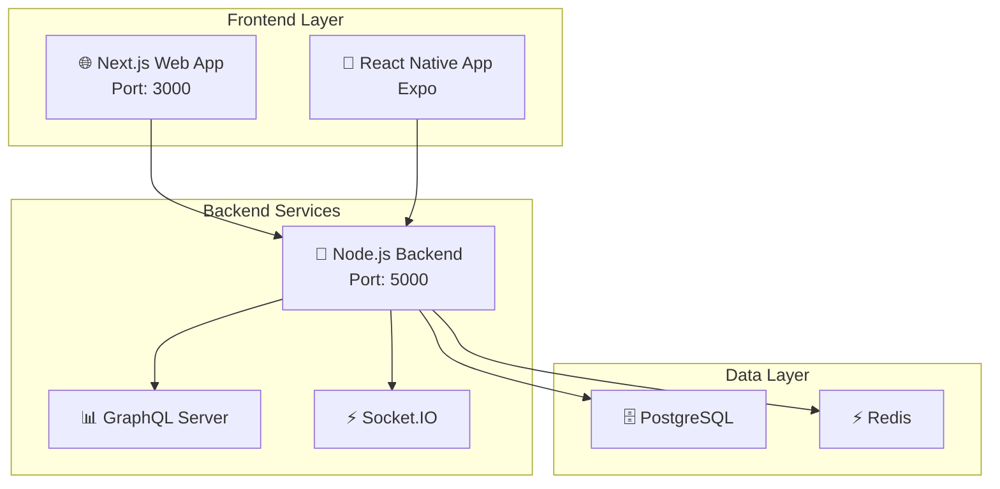

# 🏗️ Architecture SyncIt

## Vue d'ensemble

SyncIt est une application **full-stack** (web et mobile) pour organiser des événements collaboratifs en temps réel, construite avec une architecture moderne et scalable.

## 🎯 Objectifs architecturaux

- **Scalabilité**: Architecture modulaire et microservices-ready
- **Performance**: Optimisations cache, CDN, et base de données
- **Sécurité**: Authentification robuste, validation des données, protection CSRF
- **Maintenabilité**: Code TypeScript, tests automatisés, documentation
- **Développement**: Hot-reload, debugging, environnements isolés

## 📊 Diagramme d'architecture



## 🏛️ Structure du projet

```
SyncIt/
├── apps/                    # Applications principales
│   ├── backend/            # API Node.js + Express + GraphQL
│   ├── web/                # Frontend Next.js
│   └── mobile/             # App React Native (Expo)
├── packages/               # Packages partagés
│   ├── shared/            # Types TypeScript partagés
│   └── ui/                # Composants UI réutilisables
├── infra/                 # Infrastructure et configuration
│   ├── docker/            # Configurations Docker
│   ├── nginx/             # Configuration Nginx
│   └── postgres/          # Scripts de base de données
├── scripts/               # Scripts utilitaires
└── docs/                  # Documentation
```

## 🔧 Technologies utilisées

### Frontend
- **Web**: Next.js 14, Tailwind CSS, Zustand, TypeScript
- **Mobile**: React Native (Expo), TypeScript
- **État**: Zustand pour la gestion d'état simple et performante
- **UI**: Composants partagés, thème clair/sombre
- **Cache**: React Query pour la gestion des données serveur

### Backend
- **API**: Node.js 18+, Express.js, TypeScript
- **GraphQL**: Apollo Server (pour les requêtes complexes de tâches)
- **Temps réel**: Socket.IO pour le chat et les mises à jour live
- **Authentification**: JWT + OAuth2 (Google, Facebook)
- **Validation**: Zod pour la validation des données
- **Logging**: Winston pour les logs structurés

### Base de données
- **Principal**: PostgreSQL avec Prisma ORM
- **Cache**: Redis pour les sessions et données temps réel
- **Migrations**: Prisma Migrate pour la gestion des schémas

### Services externes
- **Notifications**: Firebase Cloud Messaging
- **Stockage**: Cloudinary pour les images
- **Calendrier**: Google Calendar API
- **Email**: SendGrid pour les notifications email

### DevOps
- **Conteneurs**: Docker + Docker Compose
- **CI/CD**: GitHub Actions
- **Monitoring**: Winston + Sentry
- **Déploiement**: Google Cloud Run / AWS ECS ready

## 🔄 Flux de données

### 1. Authentification
```
Client → OAuth Provider → Backend → JWT Token → Client
```

### 2. Événements CRUD
```
Client → REST API → PostgreSQL → Response → Client
```

### 3. Tâches (GraphQL)
```
Client → GraphQL → Resolvers → PostgreSQL → Response → Client
```

### 4. Chat temps réel
```
Client → Socket.IO → Redis → Broadcast → All Clients
```

### 5. Notifications
```
Event → Queue → Firebase FCM → Push Notification → Client
```

## 🗄️ Modèle de données

### Entités principales

**Users** (Utilisateurs)
- Informations de base et profil
- Providers OAuth (Google, Facebook)
- Préférences et paramètres

**Events** (Événements)
- Détails de l'événement
- Code d'invitation unique
- Statut et paramètres de visibilité

**EventParticipants** (Participants)
- Relation Many-to-Many entre Users et Events
- Rôles (Organizer, Admin, Participant)
- Statut de participation

**Tasks** (Tâches)
- Système Kanban avec statuts
- Assignation et priorités
- Commentaires et pièces jointes

**ChatMessages** (Messages)
- Messages de chat par événement
- Support des pièces jointes
- Réactions et réponses

**Notifications** (Notifications)
- Notifications push et email
- Types et préférences
- Historique de lecture

### Relations clés
- Un **User** peut créer plusieurs **Events**
- Un **Event** peut avoir plusieurs **Participants**
- Un **Event** peut avoir plusieurs **Tasks**
- Un **Event** a un **Chat** avec plusieurs **Messages**
- Un **User** peut recevoir plusieurs **Notifications**

## 🔌 API Design

### REST API
```
GET    /api/auth/profile           # Profil utilisateur
POST   /api/auth/login             # Connexion OAuth
POST   /api/auth/refresh           # Refresh token

GET    /api/events                 # Liste des événements
POST   /api/events                 # Créer un événement
GET    /api/events/:id             # Détails d'un événement
PUT    /api/events/:id             # Modifier un événement
DELETE /api/events/:id             # Supprimer un événement
POST   /api/events/:id/join        # Rejoindre un événement

GET    /api/users/search           # Rechercher des utilisateurs
PUT    /api/users/profile          # Modifier le profil
```

### GraphQL API
```graphql
# Requêtes complexes pour les tâches
query GetEventTasks($eventId: ID!, $filters: TaskFilters) {
  tasks(eventId: $eventId, filters: $filters) {
    id
    title
    status
    assignee { name }
    comments { content }
  }
}

# Mutations pour les tâches
mutation CreateTask($input: CreateTaskInput!) {
  createTask(input: $input) {
    id
    title
    status
  }
}

# Subscriptions pour les mises à jour temps réel
subscription TaskUpdated($eventId: ID!) {
  taskUpdated(eventId: $eventId) {
    id
    title
    status
  }
}
```

### WebSocket Events
```javascript
// Client vers serveur
socket.emit('join_room', eventId)
socket.emit('send_message', { eventId, content })
socket.emit('typing_start', eventId)

// Serveur vers client
socket.on('message_sent', (message) => {})
socket.on('user_typing', ({ user, eventId }) => {})
socket.on('task_updated', (task) => {})
```

## 🛡️ Sécurité

### Authentification
- **JWT tokens** avec expiration courte (1h)
- **Refresh tokens** avec expiration longue (7j)
- **OAuth2** avec Google et Facebook
- **Rate limiting** sur les endpoints sensibles

### Autorisation
- **RBAC** (Role-Based Access Control) par événement
- **Middleware** de vérification des permissions
- **Validation** des données avec Zod

### Protection des données
- **Chiffrement** des mots de passe avec bcrypt
- **Sanitization** des entrées utilisateur
- **Headers de sécurité** avec Helmet.js
- **CORS** configuré correctement

## 📈 Performance et scalabilité

### Cache Strategy
- **Redis** pour les sessions utilisateur
- **Application cache** pour les données fréquemment accédées
- **CDN** pour les assets statiques
- **Database indexing** sur les requêtes fréquentes

### Optimisations
- **Connection pooling** PostgreSQL
- **Lazy loading** des composants React
- **Image optimization** avec Cloudinary
- **Gzip compression** via Nginx

### Monitoring
- **Application logs** avec Winston
- **Error tracking** avec Sentry
- **Performance monitoring** avec métriques custom
- **Health checks** pour tous les services

## 🚀 Déploiement

### Environnements
- **Development**: Docker Compose local
- **Staging**: Google Cloud Run
- **Production**: Google Cloud Run avec SSL

### CI/CD Pipeline
1. **Lint & Type Check**: ESLint + TypeScript
2. **Tests**: Jest (unit) + Cypress (E2E)
3. **Security Scan**: npm audit + Snyk
4. **Build**: Docker images
5. **Deploy**: Google Cloud Run

### Monitoring Production
- **Uptime monitoring** avec Google Cloud Monitoring
- **Log aggregation** avec Google Cloud Logging
- **Alerts** sur les erreurs critiques
- **Performance dashboards**

## 🔧 Configuration et maintenance

### Variables d'environnement
```bash
# Base de données
DATABASE_URL=postgresql://...
REDIS_URL=redis://...

# Authentication
JWT_SECRET=...
GOOGLE_CLIENT_ID=...
FACEBOOK_APP_ID=...

# Services externes
FIREBASE_PROJECT_ID=...
CLOUDINARY_CLOUD_NAME=...
```

### Scripts de maintenance
```bash
# Sauvegarde de la base de données
npm run db:backup

# Exécution des migrations
npm run prisma:migrate

# Nettoyage des logs
npm run logs:cleanup

# Génération de rapports
npm run reports:generate
```

## 📚 Documentation additionnelle

- **API Documentation**: `apps/backend/docs/api.md`
- **Database Schema**: `apps/backend/prisma/schema.prisma`
- **Frontend Components**: `apps/web/src/components/README.md`
- **Mobile Setup**: `apps/mobile/README.md`
- **Deployment Guide**: `docs/deployment.md`

## 🤝 Contribution

1. **Architecture Decision Records**: `docs/adr/`
2. **Code Standards**: ESLint + Prettier
3. **Testing Strategy**: Unit + Integration + E2E
4. **Review Process**: Pull Request + Code Review

---

Cette architecture est conçue pour être **évolutive**, **maintenable** et **performante**, tout en offrant une excellente expérience développeur et utilisateur. 